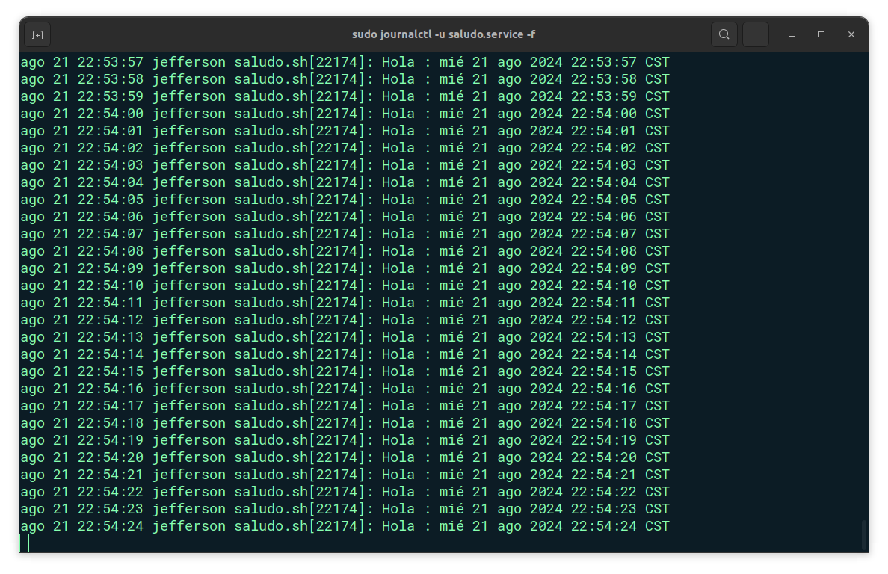

# Systemd - Servicio

Este servicio ejecuta un script que imprime un saludo junto con la fecha y hora actuales de forma indefinida, con una pausa de un segundo entre cada impresión.

## :wrench: Herramientas:

<div align="center">
	<a href="#">
		
	</a>
</div>


## Instalación

1. Script: [Saludo.sh](Saludo.sh)
    ```bash
    #!/bin/bash

    while true; do
        echo "Hola : $(date)"
        sleep 1
    done
    ```


2. Permisos de Ejecución `saludo.sh`
    ```bash
    hmod +x /usr/local/bin/saludo.sh
    ```


3. Crea el archivo de unidad `systemd` en `/etc/systemd/system/saludo.service` con el siguiente contenido:
    ```ini
    [Unit]
    Description=Saludo y Fecha Service
    After=network.target

    [Service]
    ExecStart=/usr/local/bin/saludo.sh
    Restart=always

    [Install]
    WantedBy=multi-user.target
    ```

    > NOTA: en caso de haberlo creado en otra ruta ejecutar el comando `sudo mv /ruta-actual/saludo.service /etc/systemd/system/` para mover el archivo a la ruta especificada.


4. Configuraciones de `systemd`:
    ```bash
    sudo systemctl daemon-reload
    sudo systemctl enable saludo.service
    sudo systemctl start saludo.service
    ```

5. Verificar el Estado y los Logs del Servicio
    ```bash
    sudo systemctl status saludo.service
    sudo journalctl -u saludo.service -f
    ```

    <div align="center">
        
    </div>